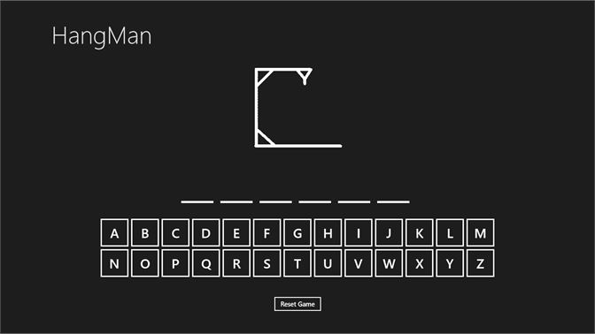

<h1 align="center">The Hangman</h1>

<div align="center">
  <br />

  

  <br />

  

  <br />


</div>

<br />

<div align="center">
  <!-- Stability -->
  <a href="https://nodejs.org/api/documentation.html#documentation_stability_index">
    
  </a>
  <!-- NPM version -->
  <a href="https://npmjs.org/package/choo">
    
  </a>
  <!-- Build Status -->
  <a href="https://travis-ci.org/choojs/choo">
    
  </a>
  <!-- Test Coverage -->
  <a href="https://codecov.io/github/choojs/choo">
    
  </a>
  <!-- Downloads -->
  <a href="https://npmjs.org/package/choo">
    
  </a>
  <!-- Standard -->
  <a href="https://standardjs.com">
    
  </a>
</div>


## Table of Contents
- [Funcionamento](#funcionamento)
- [FAQ](#faq)
- [Instalação](#instalação)
- [Veja mais](#veja-mais)
- [Apoie](#support)

## Funcionamento
- __minimal size:__ weighing `4kb`, Choo is a tiny little framework
- __event based:__ our performant event system makes writing apps easy
- __small api:__ with only 6 methods there's not much to learn
- __minimal tooling:__ built for the cutting edge `browserify` compiler
- __isomorphic:__ renders seamlessly in both Node and browsers
- __very cute:__ choo choo!

## Exemplo
```rb
codigo aqui
```

## FAQ
### Why is it called?
Because I thought it sounded cute. All these programs talk about being
_"performant"_, _"rigid"_, _"robust"_ - I like programming to be light, fun and
non-scary. Choo embraces that.

Also imagine telling some business people you chose to rewrite something
critical for serious bizcorp using a train themed framework.
:steam_locomotive::train::train::train:

### Is it or...?
It's called "Choo", though we're fine if you call it "Choo-choo" or
"Chugga-chugga-choo-choo" too. The only time "choo.js" is tolerated is if /
when you shimmy like you're a locomotive.

### Does Choo use a virtual-dom?
Choo uses [nanomorph][nanomorph], which diffs real DOM nodes instead of
virtual nodes. It turns out that [browsers are actually ridiculously good at
dealing with DOM nodes][morphdom-bench], and it has the added benefit of
working with _any_ library that produces valid DOM nodes. So to put a long
answer short: we're using something even better.

### How can I support older browsers?
Template strings aren't supported in all browsers, and parsing them creates
significant overhead. To optimize we recommend running `browserify` with
[nanohtml][nanohtml] as a global transform or using [bankai][bankai] directly.
```sh
$ browserify -g nanohtml
```

### Is production ready?
Sure.


## Instalação
```sh
$ cd hangman
$ ruby start.rb
```

## Veja Também
- [usuario](https://github.com/usuario) - contribuição
  `colorify`

## Support
Creating a quality framework takes a lot of time. Unlike others frameworks,
Choo is completely independently funded. We fight for our users. This does mean
however that we also have to spend time working contracts to pay the bills.
This is where you can help: by chipping in you can ensure more time is spent
improving Choo rather than dealing with distractions.

### Sponsors
Become a sponsor and help ensure the development of independent quality
software. You can help us keep the lights on, bellies full and work days sharp
and focused on improving the state of the web. [Become a
sponsor](https://opencollective.com/choo#sponsor)

<a href="https://opencollective.com/choo/sponsor/0/website" target="_blank"></a>
<a href="https://opencollective.com/choo/sponsor/1/website" target="_blank"></a>
<a href="https://opencollective.com/choo/sponsor/2/website" target="_blank"></a>
<a href="https://opencollective.com/choo/sponsor/3/website" target="_blank"></a>
<a href="https://opencollective.com/choo/sponsor/4/website" target="_blank"></a>
<a href="https://opencollective.com/choo/sponsor/5/website" target="_blank"></a>
<a href="https://opencollective.com/choo/sponsor/6/website" target="_blank"></a>
<a href="https://opencollective.com/choo/sponsor/7/website" target="_blank"></a>
<a href="https://opencollective.com/choo/sponsor/8/website" target="_blank"></a>
<a href="https://opencollective.com/choo/sponsor/9/website" target="_blank"></a>
<a href="https://opencollective.com/choo/sponsor/10/website" target="_blank"></a>
<a href="https://opencollective.com/choo/sponsor/11/website" target="_blank"></a>
<a href="https://opencollective.com/choo/sponsor/12/website" target="_blank"></a>
<a href="https://opencollective.com/choo/sponsor/13/website" target="_blank"></a>
<a href="https://opencollective.com/choo/sponsor/14/website" target="_blank"></a>
<a href="https://opencollective.com/choo/sponsor/15/website" target="_blank"></a>
<a href="https://opencollective.com/choo/sponsor/16/website" target="_blank"></a>
<a href="https://opencollective.com/choo/sponsor/17/website" target="_blank"></a>
<a href="https://opencollective.com/choo/sponsor/18/website" target="_blank"></a>
<a href="https://opencollective.com/choo/sponsor/19/website" target="_blank"></a>
<a href="https://opencollective.com/choo/sponsor/20/website" target="_blank"></a>
<a href="https://opencollective.com/choo/sponsor/21/website" target="_blank"></a>
<a href="https://opencollective.com/choo/sponsor/22/website" target="_blank"></a>
<a href="https://opencollective.com/choo/sponsor/23/website" target="_blank"></a>
<a href="https://opencollective.com/choo/sponsor/24/website" target="_blank"></a>
<a href="https://opencollective.com/choo/sponsor/25/website" target="_blank"></a>
<a href="https://opencollective.com/choo/sponsor/26/website" target="_blank"></a>
<a href="https://opencollective.com/choo/sponsor/27/website" target="_blank"></a>
<a href="https://opencollective.com/choo/sponsor/28/website" target="_blank"></a>
<a href="https://opencollective.com/choo/sponsor/29/website" target="_blank"></a>

### Backers
Become a backer, and buy us a coffee (or perhaps lunch?) every month or so.
[Become a backer](https://opencollective.com/choo#backer)

<a href="https://opencollective.com/choo/backer/0/website" target="_blank"></a>
<a href="https://opencollective.com/choo/backer/1/website" target="_blank"></a>
<a href="https://opencollective.com/choo/backer/2/website" target="_blank"></a>
<a href="https://opencollective.com/choo/backer/3/website" target="_blank"></a>
<a href="https://opencollective.com/choo/backer/4/website" target="_blank"></a>
<a href="https://opencollective.com/choo/backer/5/website" target="_blank"></a>
<a href="https://opencollective.com/choo/backer/6/website" target="_blank"></a>
<a href="https://opencollective.com/choo/backer/7/website" target="_blank"></a>
<a href="https://opencollective.com/choo/backer/8/website" target="_blank"></a>
<a href="https://opencollective.com/choo/backer/9/website" target="_blank"></a>
<a href="https://opencollective.com/choo/backer/10/website" target="_blank"></a>
<a href="https://opencollective.com/choo/backer/11/website" target="_blank"></a>
<a href="https://opencollective.com/choo/backer/12/website" target="_blank"></a>
<a href="https://opencollective.com/choo/backer/13/website" target="_blank"></a>
<a href="https://opencollective.com/choo/backer/14/website" target="_blank"></a>
<a href="https://opencollective.com/choo/backer/15/website" target="_blank"></a>
<a href="https://opencollective.com/choo/backer/16/website" target="_blank"></a>
<a href="https://opencollective.com/choo/backer/17/website" target="_blank"></a>
<a href="https://opencollective.com/choo/backer/18/website" target="_blank"></a>
<a href="https://opencollective.com/choo/backer/19/website" target="_blank"></a>
<a href="https://opencollective.com/choo/backer/20/website" target="_blank"></a>
<a href="https://opencollective.com/choo/backer/21/website" target="_blank"></a>
<a href="https://opencollective.com/choo/backer/22/website" target="_blank"></a>
<a href="https://opencollective.com/choo/backer/23/website" target="_blank"></a>
<a href="https://opencollective.com/choo/backer/24/website" target="_blank"></a>
<a href="https://opencollective.com/choo/backer/25/website" target="_blank"></a>
<a href="https://opencollective.com/choo/backer/26/website" target="_blank"></a>
<a href="https://opencollective.com/choo/backer/27/website" target="_blank"></a>
<a href="https://opencollective.com/choo/backer/28/website" target="_blank"></a>
<a href="https://opencollective.com/choo/backer/29/website" target="_blank"></a>

## License
[MIT](https://tldrlegal.com/license/mit-license)

[nanocomponent]: https://github.com/choojs/nanocomponent
[nanolru]: https://github.com/s3ththompson/nanolru
[bankai]: https://github.com/choojs/bankai
[nanohtml]: https://github.com/choojs/nanohtml
[browserify]: https://github.com/substack/node-browserify
[budo]: https://github.com/mattdesl/budo
[es2020]: https://github.com/yoshuawuyts/es2020
[handbook]: https://github.com/yoshuawuyts/choo-handbook
[hyperx]: https://github.com/substack/hyperx
[morphdom-bench]: https://github.com/patrick-steele-idem/morphdom#benchmarks
[nanomorph]: https://github.com/choojs/nanomorph
[nanorouter]: https://github.com/choojs/nanorouter
[yo-yo]: https://github.com/maxogden/yo-yo
[unassertify]: https://github.com/unassert-js/unassertify
[window-performance]: https://developer.mozilla.org/en-US/docs/Web/API/Performance
