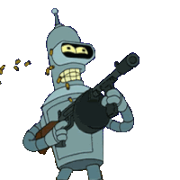

# The Hangman

<div align="center">
  <br />

  

</div>

<br />

# Sumário

<br />

- [Como o jogo funciona](#como-o-jogo-funciona)
- [Executando o jogo](#executando-o-jogo)
- [Troubleshooting](#troubleshooting)
- [Contribua](#contribua)

<br />

# Como o jogo funciona

<br />

## __Hangman__ ou simplesmente __Jogo da Forca__ funciona da seguinte maneira:

<br />

<p> O jogador tem que acertar qual é a palavra proposta, tendo como dica o número de letras e o tema ligado à palavra. A cada letra errada, é desenhado uma parte do corpo do enforcado. O jogo termina ou com o acerto da palavra ou com o término do preenchimento das partes corpóreas do enforcado. </p>

<p><strong>Observação:</strong> Pode-se escolher entre falar uma letra ou <strong>fazer uma tentativa perigosa de tentar adivinhar a palavra falando a palavra que pensa que é.</strong> Nesse caso, se errar a palavra, perderá na hora.</p>

<br />

# Executando o jogo

<br />

1. Baixe o respositório, vá até o diretório do projeto.

2. Execute `bundle install` para instalar as dependências

3. E por último, rode o jogo:

<br />

```sh
$ ruby start.rb
```

<br />

4. __(Idioma Opcional: pt-BR)__

<br />

```sh
$ ruby start.rb pt-BR
```

<br />

# Troubleshooting

<br />

### Em algumas ocasiões, especialmente se você utilizar Mac, você poderá se deparar com um caracter __^M__ ao apertar a tecla __ENTER__:

<br />

```sh
Digite uma letra: a^M
```

<br />

### A solução: 

<br />

```sh
$ stty sane
```

<br />

# Contribua

<br />

Esse simples projeto possui um signifcado importante, pois me serviu tanto para aprendizado técnico quanto para o desenvolimento pessoal. Sabendo das minhas limitações, antes mesmo de iniciar o desenvolvimento do jogo eu já tinha o costume de resolver katas nos tempos livres para desenvolver alguns predicados ainda adormecidos. Mas foi com a história contida nesse artigo que tudo mudou: [CodeKata: How It Started](http://codekata.com/kata/codekata-how-it-started/), foi a partir dele que obtive o costume de desenvolver sem compromissos entre o certo ou o errado, adotar algo e investir tempo, apenas com o objetivo de aperfeiçoar _- e se divertir, claro!_ 

Experimentar, improvisar, comparar com o que já foi feito, refazer se for preciso, mas sem a obrigatoriedade de chegar a algum lugar. 

Fiquem à vontade para contribuir, apontar issues, melhorias e, se quiserem, participar!

<br />

# Apoiadores

<br />

Seja um apoiador! Veja só aí, se até o __Bender__ nos apóia... porque você não apoiaria!?

<br />

[](https://futurama.fandom.com/pt-br/wiki/Bender_Bending_Rodr%C3%ADguez)
